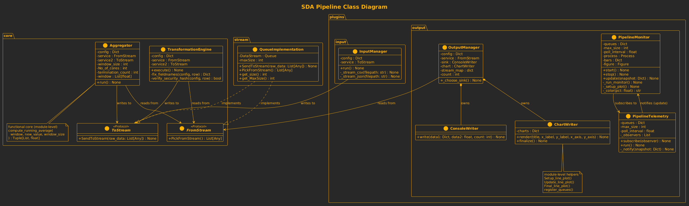
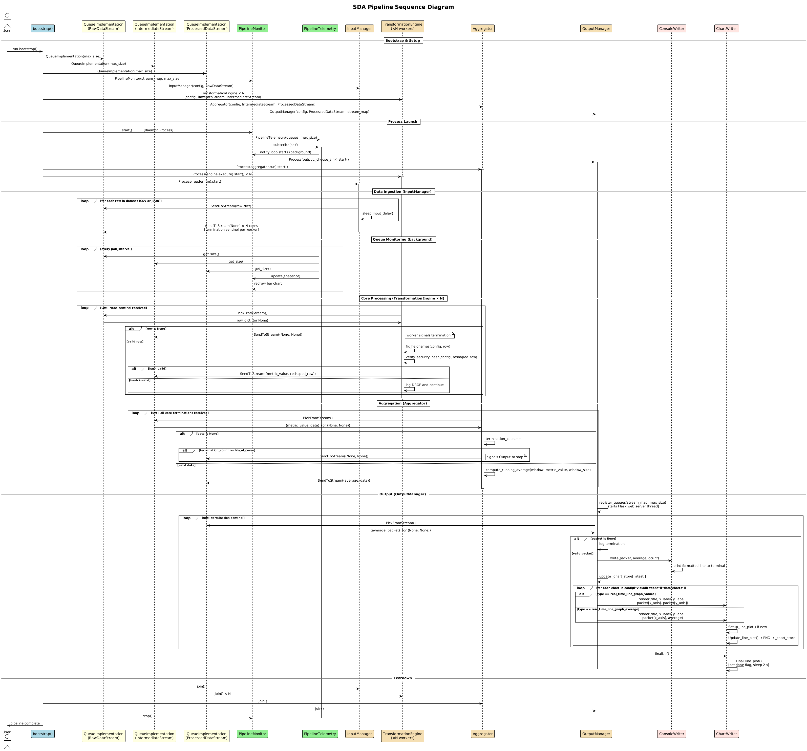

# Real Time, Concurrent, Generic Data Pipeline

A simple python dataset visualizer and analyzer that uses any generic dataset and virtualizes threads to get new cores to process the data.

---

## Rationale

Made for our SDA semester project, the major purpose of this project is to showcase strong functional programming concepts, and clean architecture. The program is modular, concurrent, pipelined, and configuration based. Showcasing the power and succinctness of the Functional Programming Paradigm. Documentation is a key aspect of the codebase.

---

## Class Diagram



## Sequence Diagram


---

## Project Structure
```bash
Global-GDP-Analysis/
├── config.json
├── core/
│   ├── aggregator.py
│   ├── data_processor.py
│   ├── __init__.py
│   └── protocols.py
├── data/
│   ├── gdp_with_continent_filled.json
│   ├── unseen_climate_data.csv
│   └── World_Bank_Dataset.csv
├── main.py
├── plugins/
│   ├── input/
│   │   ├── data_loader.py
│   │   └── __init__.py
│   └── output/
│       ├── chart_implementations.py
│       ├── chart_writer.py
│       ├── console_writer.py
│       ├── __init__.py
│       ├── pipeline_monitor.py
│       ├── pipeline_telemetry.py
│       ├── protocols.py
│       └── web/
│           ├── __init__.py
│           ├── server.py
│           ├── static/
│           │   └── style.css
│           └── templates/
│               └── index.html
├── README.md
├── readme.txt
├── requirements.txt
└── stream/
    ├── __init__.py
    └── Stream.py
```

---

## Installation Instructions
<details>
  <summary>Cloning the Repository</summary>

```bash
git clone https://github.com/OrionShinesBright/Global-GDP-Analysis/
cd Global-GDP-Analysis/
```

</details>

<details>
  <summary>Get Dependencies</summary>

```bash
# For Archlinux
sudo pacman -S --needed base-devel python python-pip

# For Ubuntu
sudo apt install -y python3-tk python3-pip git curl python-is-python3 python3
```
</details>

<details>
  <summary>Get the Dependencies</summary>

```bash
pip install -r requirements.txt --break-system-packages
```

</details>

<details>
  <summary>Run the Dashboard</summary>

```bash
python main.py
```

</details>

---

## External Tools

We have made use of the following external tools, to improve the smoothness of our workflows:
1. [ruff](https://github.com/astral-sh/ruff) (for formatting python code)
2. [matplotlib](https://matplotlib.org/) (for visualization and plotting graphs)
3. [flask](https://flask.palletsprojects.com/en/stable/) (for serving the dashboard as web pages)
